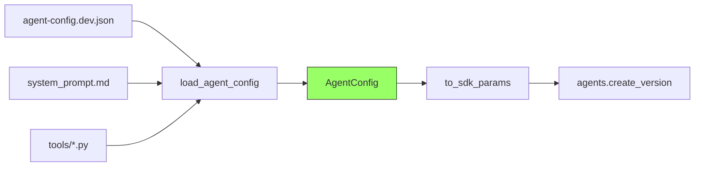

# Agent Definition

How configuration files become SDK API calls.

---

## The Core File: `agent_definition.py`

This is the most important file in the repository. It:

1. Loads a per-environment JSON config file
2. Reads the system prompt from a markdown file
3. Resolves tool definitions from Python code
4. Produces the exact parameters for `agents.create_version()`

```python title="src/agent/agent_definition.py" linenums="1"
@dataclass
class AgentConfig:
    """Everything needed to create an agent via the SDK."""
    name: str
    model: str
    instructions: str
    tools: list
    metadata: dict

    def to_sdk_params(self) -> dict:
        """Convert to the dict that agents.create_version() expects (SDK v2)."""
        from azure.ai.projects.models import PromptAgentDefinition

        # Filter to SDK-compatible built-in tools
        simple_tools = [
            t for t in self.tools
            if isinstance(t, dict) and t.get("type") in ("code_interpreter", "file_search")
        ]

        definition = PromptAgentDefinition(
            model=self.model,
            instructions=self.instructions,
            tools=simple_tools if simple_tools else None,
        )
        return {
            "name": self.name,
            "definition": definition,
            "metadata": self.metadata,
        }
```

!!! info "SDK v2 — `PromptAgentDefinition`"
    The `azure-ai-projects` SDK v2 wraps model, instructions, and tools into a
    `PromptAgentDefinition` object. This is passed as the `definition` parameter
    to `agents.create_version()`. The old v1 flat-parameter style (`create_agent(model=..., instructions=...)`)
    no longer works.

## Config File → AgentConfig → SDK Call



## The Config File Format

```json title="config/agent-config.dev.json"
{
    "agent": {
        "name": "foundry-demo-agent-dev",
        "model": "gpt-4o-mini",
        "instructions_file": "src/agent/prompts/system_prompt.md",
        "tools": [
            {"type": "code_interpreter"},
            {
                "type": "function",
                "function_name": "calculator"
            }
        ]
    },
    "evaluation": {
        "thresholds": {
            "groundedness": 3.0,
            "relevance": 3.0,
            "coherence": 3.0
        }
    }
}
```

### Field Reference

| Field | Type | Description |
|-------|------|-------------|
| `agent.name` | string | Agent name in Foundry (must be unique per project) |
| `agent.model` | string | Model deployment name (e.g., `gpt-4o-mini`) |
| `agent.instructions_file` | string | Path to system prompt file (relative to repo root) |
| `agent.tools` | array | Tool definitions (code_interpreter, function, etc.) |
| `evaluation.thresholds` | object | Min scores for quality gate (1-5 scale) |

## Adding a New Tool

1. Create the tool in `src/agent/tools/`:

    ```python title="src/agent/tools/my_tool.py"
    def get_my_tool_definition():
        return {
            "type": "function",
            "function": {
                "name": "my_tool",
                "description": "Does something useful",
                "parameters": {
                    "type": "object",
                    "properties": {
                        "input": {"type": "string", "description": "The input"}
                    },
                    "required": ["input"]
                }
            }
        }
    ```

2. Export it from `src/agent/tools/__init__.py`

3. Add it to the config:

    ```json
    {"type": "function", "function_name": "my_tool"}
    ```

4. The `load_agent_config()` function automatically resolves the tool name
   to its full definition.
