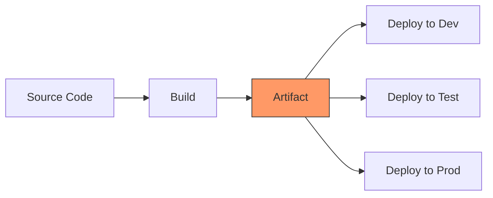
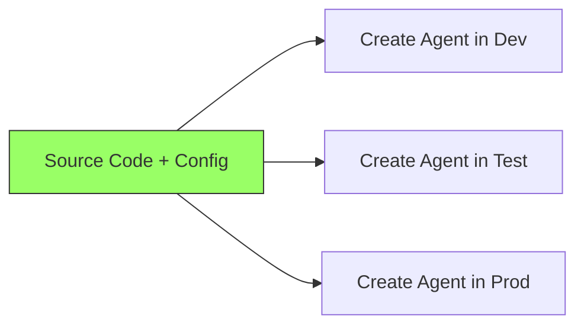

# The Mental Model

The single most important concept to understand.

---

## Traditional CI/CD vs. Foundry Agent CI/CD

### Traditional (Containers, Binaries)



You build **one artifact** and promote it through environments.
The artifact is the unit of deployment.

### Foundry Agents (No Artifact)



There is **no artifact**. The source code IS the deployable.
Each environment gets a fresh agent created from the same code
but with different config.

!!! info "Key Insight"
    There is no export/import or artifact promotion mechanism.
    Your code and config **are** the deployment unit. The SDK
    creates a new versioned agent in each environment.

## What Makes Up an Agent?

An agent is just configuration applied via the SDK:

| Component | File(s) | What It Controls |
|-----------|---------|-----------------|
| **Name** | `config/agent-config.{env}.json` | Identity in Foundry |
| **Model** | `config/agent-config.{env}.json` | Which LLM powers it |
| **System Prompt** | `src/agent/prompts/system_prompt.md` | Behavior instructions |
| **Tools** | `src/agent/tools/*.py` | What the agent can do |
| **Eval Thresholds** | `config/agent-config.{env}.json` | Quality requirements |

## The Deployment Primitive

Every deployment boils down to one SDK call:

```python
from azure.ai.projects import AIProjectClient
from azure.ai.projects.models import PromptAgentDefinition
from azure.identity import DefaultAzureCredential

client = AIProjectClient(
    endpoint="https://your-account.services.ai.azure.com/api/projects/your-project",
    credential=DefaultAzureCredential()
)

agent = client.agents.create_version(
    agent_name="my-agent-dev",
    definition=PromptAgentDefinition(
        model="gpt-4o-mini",
        instructions="You are a helpful assistant...",
        tools=[{"type": "code_interpreter"}],
    ),
    metadata={"environment": "dev"},
)
```

That's it. **Everything else in this repo is plumbing around this call.** If the agent name already exists, it creates a new version; if not, it creates the agent.

- Config files → decide what parameters to pass
- Deploy scripts → wrap this call with error handling and logging
- CI/CD pipelines → run this call in the right environment with the right auth
- Evaluation → validate the agent works after this call

## Why Versioned Agents?

We create a new **version** of the agent on each deployment using `agents.create_version()`.
If the agent name doesn't exist yet, it creates the agent. If it already exists, it adds a new version with the updated config.

**Why not delete and recreate?**

1. **No downtime** — old version stays active until the new one is ready
2. **Stable identity** — agent name persists across deployments
3. **Audit trail** — metadata tracks which git commit is deployed per version
4. **Simpler logic** — `create_version()` handles both new and existing agents

**The trade-off:**

- Agent versions accumulate (use the teardown script to clean up)
- Must ensure consumers reference the correct version or latest
